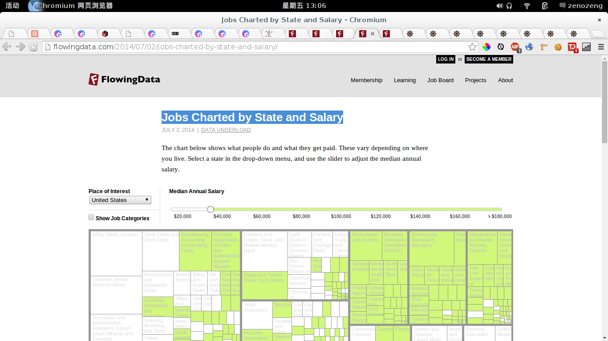
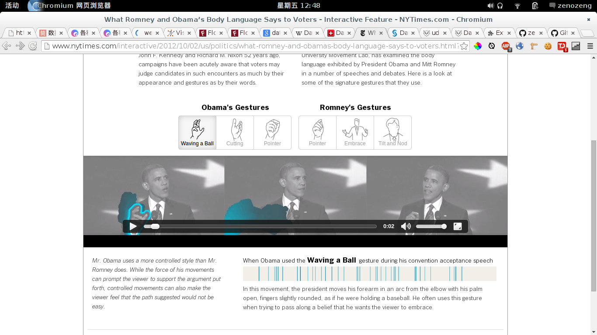

# Data Visualization Examples

## TreeMap

### The Billion Pound-O-Gram

Link: http://www.informationisbeautiful.net/visualizations/the-billion-pound-o-gram/

适用范围：数据层次关系、父子节点关系。

类似的例子还有：http://www.informationisbeautiful.net/visualizations/the-bbc-o-gram/

### FoamTree

Link: http://get.carrotsearch.com/foamtree/demo/demos/large.html

适用范围：超大层级关系的树状关系

可以很清晰地表达层间关系，位于父节点时，只会粗略显示子节点。
而使用双击缩放进入的方式来使得遍历节点的视觉感知清晰。

## Etc

### Jobs Charted by State and Salary

Link: http://flowingdata.com/2014/07/02/jobs-charted-by-state-and-salary/

一个数据与筛选条件轴联动的例子。

### Visualizing MBTA Data

An interactive exploration of Boston's subway system.

Link: http://mbtaviz.github.io/

这是一个交通流量的例子，但是鉴于交通流量与网络流量的相似性，这个例子还是非常有参考价值的。

`Subway Trips on Monday February 3, 2014` 这个图让人印象深刻，
有非常强的数据交互联动，可以很直观的感受到数据随着时间的流动。

与之类似，亦可以一个时间轴作为交互对量，另一侧放上流量情况，以小原点代表一波波的流量。
拖动时间轴就可以直观感受流量的流动。
以及，当时间轴处于非hover状态时可以以稳恒速率自动滚动之。

图中圆点代表了车子的位置，亦可在实际网络流量中用用户所处的位置　入口　-> 出口　各点串成一个线状球。

这张图则是代表每个站点的IO情况。
右边那个Avg情况分成两排上为 input ，下为　output 。
然后以小的方格展示各个时段的情况，可以非常直观地展示一些细节情况。

### Analyzing Presidential Candidate’s Body Language

Link: http://www.nytimes.com/interactive/2012/10/02/us/politics/what-romney-and-obamas-body-language-says-to-voters.html?hp&_r=0

手势的一个分析。

