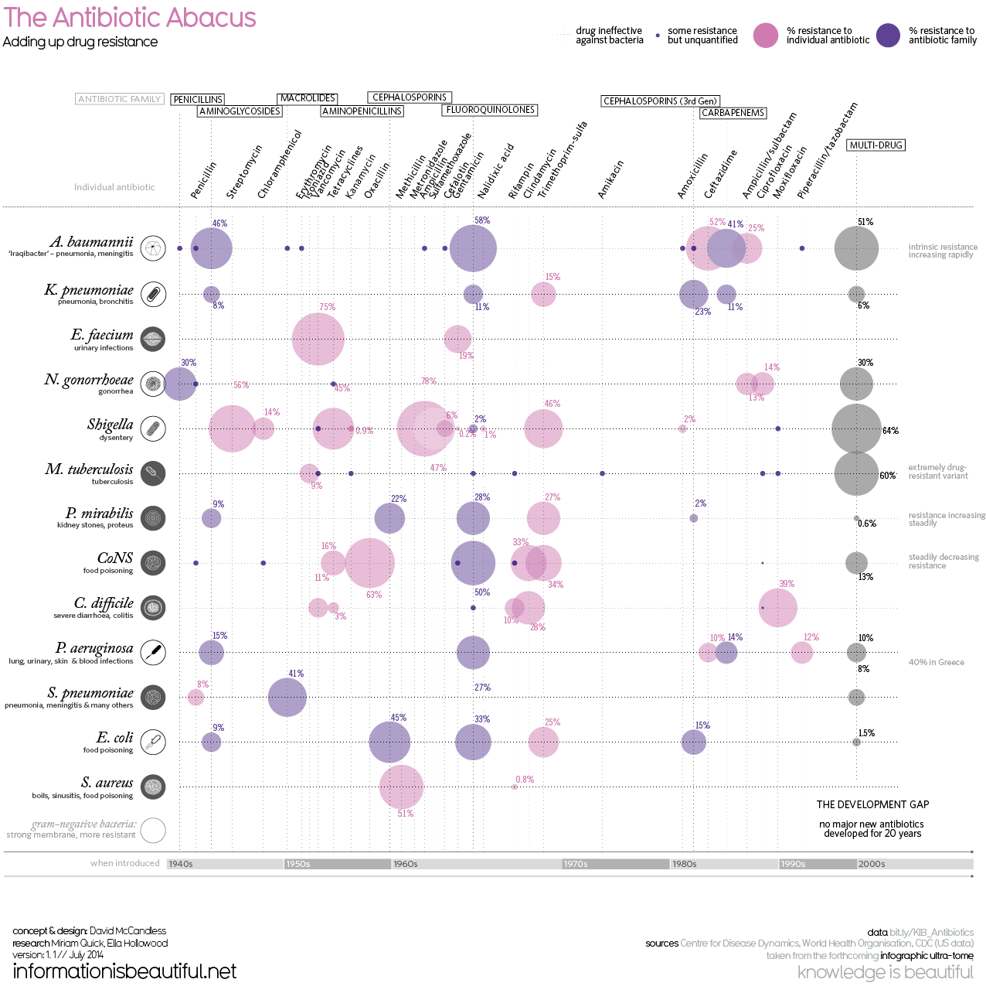
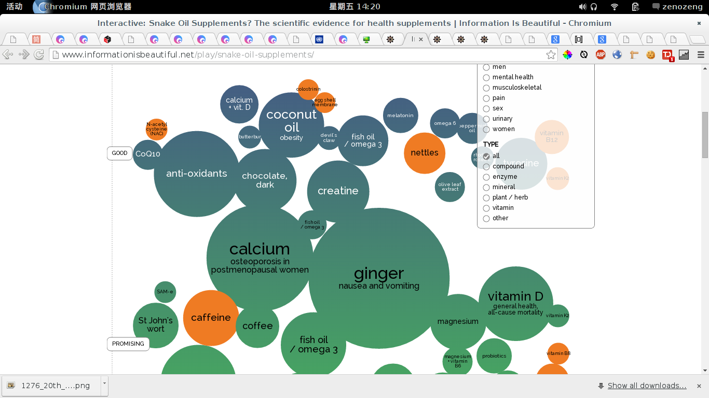
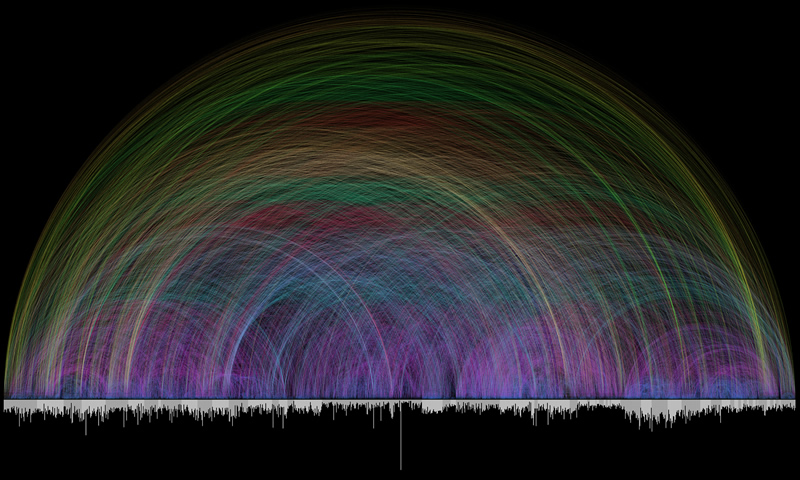
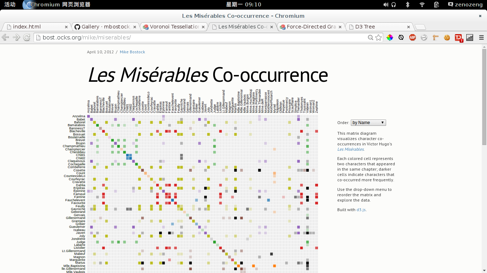
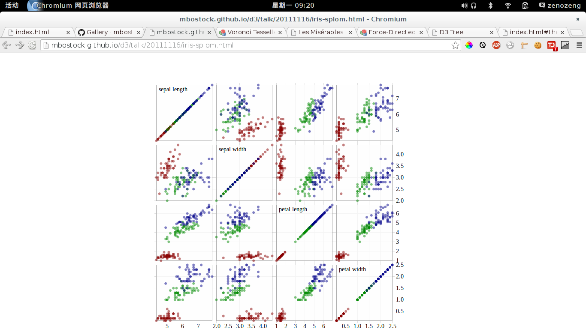
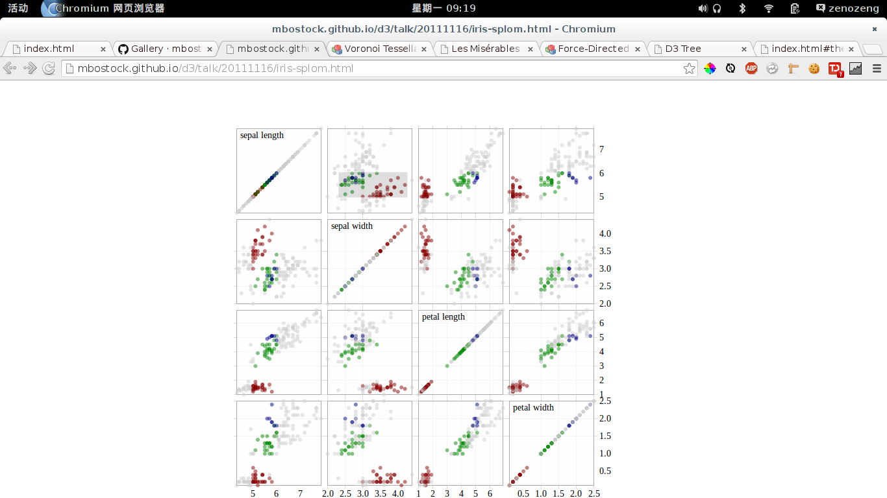
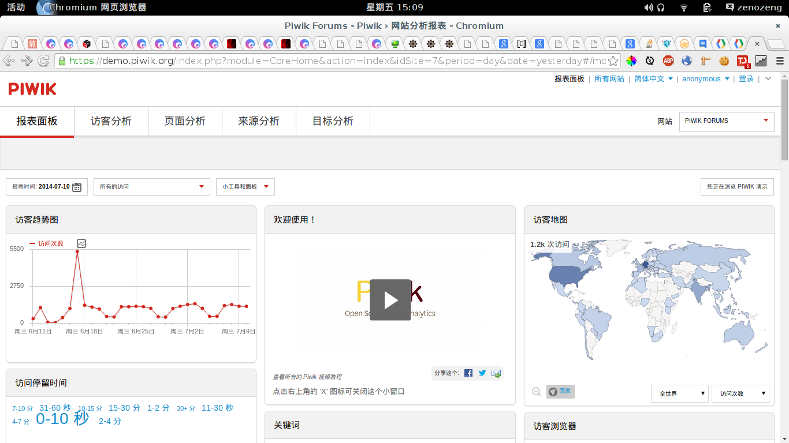
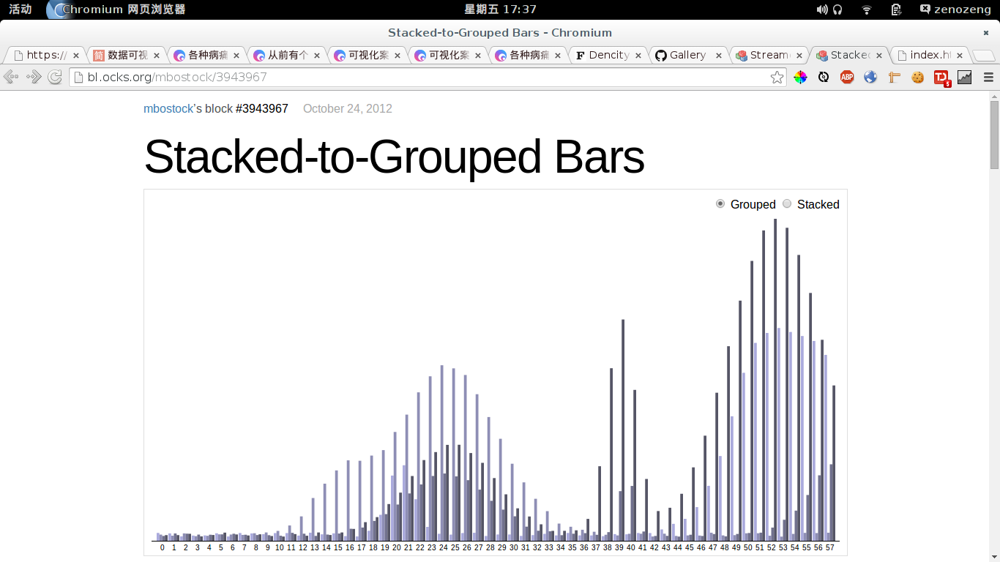

# Data Visualization Examples

## TreeMap

### The Billion Pound-O-Gram

Link: [http://www.informationisbeautiful.net/visualizations/the-billion-pound-o-gram/](http://www.informationisbeautiful.net/visualizations/the-billion-pound-o-gram/)

适用范围：数据层次关系、父子节点关系。

类似的例子还有：[http://www.informationisbeautiful.net/visualizations/the-bbc-o-gram/](http://www.informationisbeautiful.net/visualizations/the-bbc-o-gram/)

### FoamTree

Link: [http://get.carrotsearch.com/foamtree/demo/demos/large.html](http://get.carrotsearch.com/foamtree/demo/demos/large.html)

适用范围：超大层级关系的树状关系

可以很清晰地表达层间关系，位于父节点时，只会粗略显示子节点。
而使用双击缩放进入的方式来使得遍历节点的视觉感知清晰。

## 气泡图

### The Antibiotic Abacus

Link: [http://www.informationisbeautiful.net/visualizations/antibiotic-resistance/](http://www.informationisbeautiful.net/visualizations/antibiotic-resistance/)

适用范围：多坐标维度交叉相关信息呈现。

### 20th Century Death

Link: [http://www.informationisbeautiful.net/visualizations/20th-century-death/](http://www.informationisbeautiful.net/visualizations/20th-century-death/)

适用范围：简单的层级关系，相对大小呈现

### Snake Oil Supplements?

Link: [http://www.informationisbeautiful.net/play/snake-oil-supplements/](http://www.informationisbeautiful.net/play/snake-oil-supplements/)

左侧的坐标轴与右侧的筛选是其亮点。

### Better force layout node selection

Link: [http://bl.ocks.org/couchand/6420534](http://bl.ocks.org/couchand/6420534)

交互非常有趣，而且拉动对整个团的拖动效果可以直观地让人感受到数据的相关关系。

## 平行坐标轴

### peoplemov.in (IO)

Link: [http://peoplemov.in/](http://peoplemov.in/)

适用范围：出入关系

以线直接相连，用渐变表示这是一根相连的线。
线的粗细表示流量的大小。

此展现方式亦非常适用于网站流量出入的展示。

### worldshapin (IO)

Link: [http://www.worldshap.in/#/03/US/](http://www.worldshap.in/#/03/US/)

使用范围：多维度的数据对比

对于一个网站流量系统，可以将多个 site 的众多维度 访客量、驻留时间、跳出率 等因素叠在一起做一个类似的东西

### iris-parallel

Link: [http://mbostock.github.io/d3/talk/20111116/iris-parallel.html](http://mbostock.github.io/d3/talk/20111116/iris-parallel.html)

能够相对清晰地表明各个坐标的多个参数高低。

## 可拖动轴

### Visualizing MBTA Data (IO)

An interactive exploration of Boston's subway system.

Link: [http://mbtaviz.github.io/](http://mbtaviz.github.io/)

这是一个交通流量的例子，但是鉴于交通流量与网络流量的相似性，这个例子还是非常有参考价值的。

`Subway Trips on Monday February 3, 2014` 这个图让人印象深刻，
有非常强的数据交互联动，可以很直观的感受到数据随着时间的流动。

与之类似，亦可以一个时间轴作为交互对量，另一侧放上流量情况，以小原点代表一波波的流量。
拖动时间轴就可以直观感受流量的流动。
以及，当时间轴处于非hover状态时可以以稳恒速率自动滚动之。

图中圆点代表了车子的位置，亦可在实际网络流量中用用户所处的位置　入口　-> 出口　各点串成一个线状球。

这张图则是代表每个站点的IO情况。
右边那个Avg情况分成两排上为 input ，下为　output 。
然后以小的方格展示各个时段的情况，可以非常直观地展示一些细节情况。

### Jobs Charted by State and Salary

Link: [http://flowingdata.com/2014/07/02/jobs-charted-by-state-and-salary/](http://flowingdata.com/2014/07/02/jobs-charted-by-state-and-salary/)

一个数据与筛选条件轴联动的例子。

## 网络图

### Bible Cross-References

Link: [http://www.chrisharrison.net/index.php/Visualizations/BibleViz](http://www.chrisharrison.net/index.php/Visualizations/BibleViz)

注意颜色是与章节的远近相关的。底下的灰白分隔表示章节。每一个柱对应一句话。

### DependencyWheel

Link: [http://redotheweb.com/DependencyWheel/](http://redotheweb.com/DependencyWheel/)

注意悬停一会可以显示其依赖关系。

## 地图

### Dencity

Link: [http://fathom.info/dencity/](http://fathom.info/dencity/)

点的大小代表着个人的生存空间大小。

### World Bank Global Development Sprint

Link: [http://d3.artzub.com/wbca/](http://d3.artzub.com/wbca/)

## 热力图

~~关于热力图，有个想法。就是不仅仅只是跟踪鼠标的点击。而是同时监听hover事件。这样可以获得鼠标的轨迹。~~
似乎这个想法不大靠谱，劫持hover对性能的开销似乎不小而且意义并非那么大。

### webgl热力图-5个商圈的24小时

Link: [webgl热力图-5个商圈的24小时](http://datavlab.org/cat/%E5%8F%AF%E8%A7%86%E5%8C%96%E6%A1%88%E4%BE%8B/%E5%8F%AF%E8%A7%86%E5%8C%96%E5%B1%95%E7%8E%B0%E7%B1%BB%E5%9E%8B/%E7%83%AD%E5%8A%9B%E5%9B%BE)

## Matrix

### Les Misérables Co-occurrence (IO)

Link: [http://bost.ocks.org/mike/miserables/](http://bost.ocks.org/mike/miserables/)

一个有趣的矩阵。
嘛，切换右上角的 order 会有 transition 动画可以看。
觉得对流量分析也是挺有价值的。
有两个维度，一个可为 input，二另一个可为 output，
则相交的高亮色块可表示该条流量路径的相对流量大小。
以其流量与热力学温度正相关，然后转化为色温，
就能非常直观地感受整个的流量情况。

如果要是和时间轴（或其他某个参数轴）相结合的话，就能感受到，
各个路径流量色块随着该参数而变化的样子。
嘛，应该还是挺有趣的。

### iris-splom (IO)

Link: [http://mbostock.github.io/d3/talk/20111116/iris-splom.html](http://mbostock.github.io/d3/talk/20111116/iris-splom.html)

四个参数，每张图（除开对角线）表示其中两个参数的相关关系。
非常值得注意的是，每个图是可以用矩形选择（见下图）区域的，
选择发生后，在矩形区域的点集会在16图上被高亮，
而其他的点则是被灰化显示。
可以非常直观地感受一部分点的各个参数相关情况。

则对于流量分析，可以得知一部分目标用户集（比如A参数和B参数都位于右上角的用户）
各个参数相关情况的情况。对于快速分析目标用户的情况还是非常有帮助的。

## Etc

### Analyzing Presidential Candidate’s Body Language

Link: [http://www.nytimes.com/interactive/2012/10/02/us/politics/what-romney-and-obamas-body-language-says-to-voters.html?hp&_r=0](http://www.nytimes.com/interactive/2012/10/02/us/politics/what-romney-and-obamas-body-language-says-to-voters.html?hp&_r=0)

手势的一个分析。

### Piwik

Link: [https://demo.piwik.org/](https://demo.piwik.org/index.php?module=CoreHome&action=index&idSite=7&period=day&date=yesterday#/module=Dashboard&action=embeddedIndex&idSite=7&period=day&date=yesterday&idDashboard=1)

### Calendar View

Link: [http://bl.ocks.org/mbostock/4063318](http://bl.ocks.org/mbostock/4063318)

类似于 Github 的 Commit 那个记录。
可以相对直观地反应较长期中各天的情况。

### Stacked-to-Grouped Bars

Link: [http://bl.ocks.org/mbostock/3943967](http://bl.ocks.org/mbostock/3943967)

有上有 Stacked 和 Grouped 的一键切换，非常直观的。

### Streamgraph

Link: [http://bl.ocks.org/mbostock/4060954](http://bl.ocks.org/mbostock/4060954)

For continuous data such as time series, a streamgraph can be used in place of stacked bars. 

## 总结

- 联动

    一组数据的各个部分需要联动来体现其相关关系。
    
- 交互

    用户应该能够选择参数进行调整，或者能够进行筛选数据集的行为。
