# Data Visualization Examples

## Flow Visualization

### Energy technologies visualisation for the IEA

Link: [http://visualisingdata.com/index.php/2012/06/energy-technologies-visualisation-for-the-iea/](http://visualisingdata.com/index.php/2012/06/energy-technologies-visualisation-for-the-iea/)

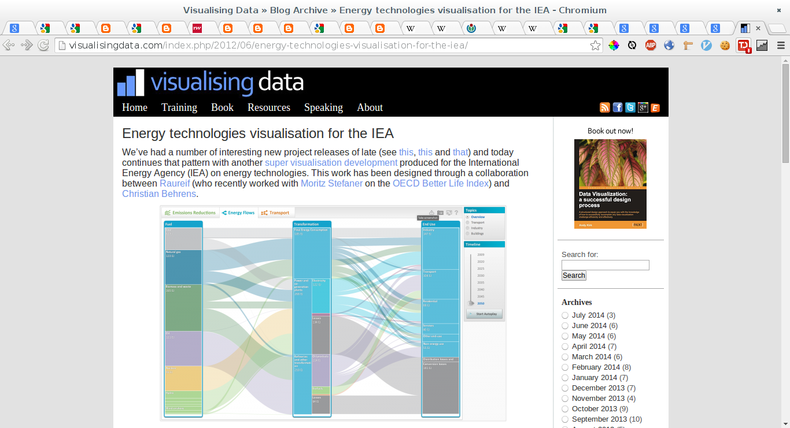

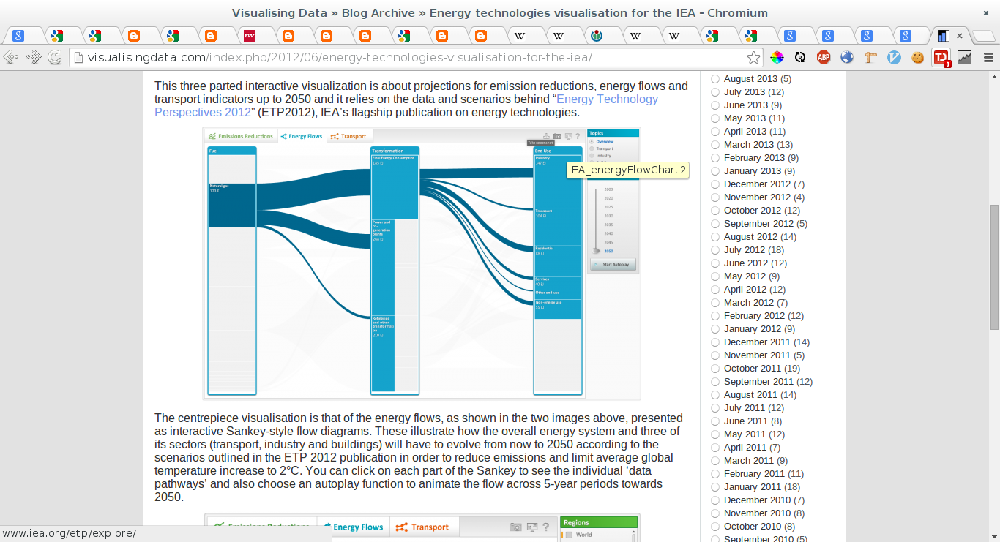

### Google Analytics

Link: [https://support.google.com/analytics/topic/2472754?hl=en&ref_topic=1727148](https://support.google.com/analytics/topic/2472754?hl=en&ref_topic=1727148)

Link: [http://analytics.blogspot.jp/2011/10/introducing-flow-visualization.html](http://analytics.blogspot.jp/2011/10/introducing-flow-visualization.html)

The images below are from http://analytics.blogspot.jp/2011/10/introducing-flow-visualization.html.

#### The anatomy of a Flow Report

A flow visualization is a graphic that a traces a route or a path, like a trail through a forest. Unlike a map, which displays possible and known routes, a flow visualization reveals the actual path as it was traveled step by step, including any detours or backtracking that happened along the way.^[https://support.google.com/analytics/answer/2519986?hl=en&ref_topic=2472754]

#### Visitor Flow

Visitors Flow is a graphical representation of the paths users took through your site, from the source, through the various pages, and where along their paths they exited your site.^[https://support.google.com/analytics/answer/1709395?hl=en#&utm\_source=analytics&utm\_campaign=eventsflow&utm_medium=blog]

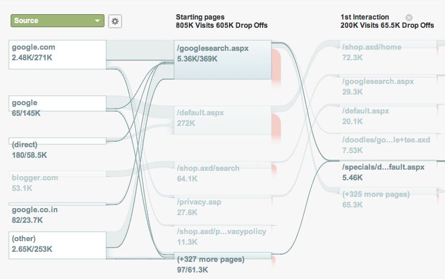

#### Goal Flow

The Goal Flow Report visualizes the path your traffic traveled through a funnel towards a Goal. This report can help you see if users are navigating your content and completing a targeted objective as you expect them to.^[https://support.google.com/analytics/answer/2520139?hl=en#&utm\_source=analytics&utm\_campaign=eventsflow&utm_medium=blog]

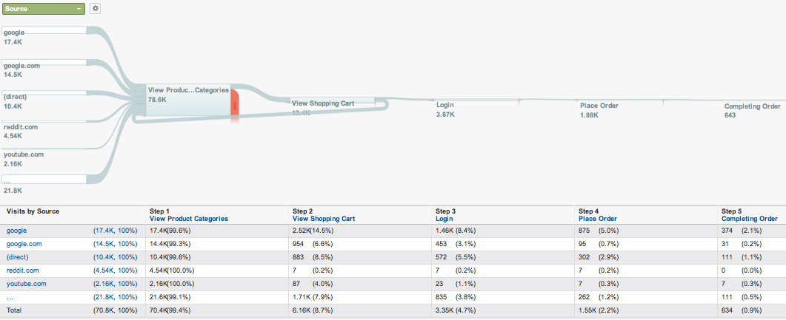

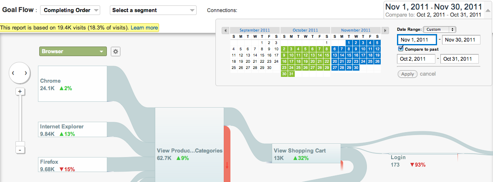

#### Event Flow

If you’re tracking special content like videos, downloadable items, and embedded gadgets as Events, use the Events Flow report to visualize the order in which users trigger these Events on your site. The Events Flow report can help you discover what content keeps users engaged with your site, and see the paths users take from one popular Event to the next.^[https://support.google.com/analytics/answer/2521316?hl=en#&utm\_source=analytics&utm\_campaign=eventsflow&utm_medium=blog]

### Charles Joseph Minard

Link: [http://en.wikipedia.org/wiki/Charles_Joseph_Minard](http://en.wikipedia.org/wiki/Charles_Joseph_Minard)

The graph displays several variables in a single two-dimensional image:

- the size of the army - providing a strong visual representation of human suffering, e.g. the sudden decrease of the army's size at the battle crossing the Berezina river on the retreat;

- the geographical co-ordinates, latitude and longitude, of the army as it moved;

- the direction that the army was traveling, both in advance and in retreat, showing where units split off and rejoined;

- the location of the army with respect to certain dates;

- the weather temperature along the path of the retreat, in another strong visualisation of events (during the retreat "one of the worst winters in recent memory set in"[1]).

### Mixpanel

Link: [Mixpanel Flow Helps Companies Visualize User Activity](http://techcrunch.com/2012/03/22/mixpanel-flow/)

The Campaign Flow shows visitor traffic sources and destinations for a user-specified URL.

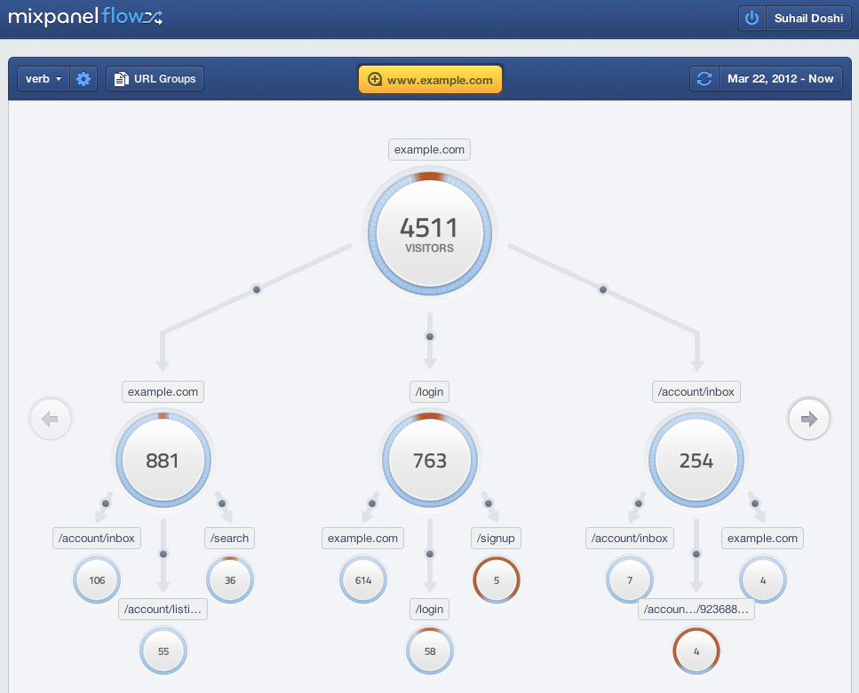

### webtrends

Link: [http://help.webtrends.com/en/streams/streams_campaign_flow.html](http://help.webtrends.com/en/streams/streams_campaign_flow.html)

### YY

结合我们的需求，可以考虑按照 Google / Charles Joseph Minard 这个框架来做。

- 径流代表流量的大小

- 块面积代表流量大小等。

- 蓝色代表流入下一级

- 红色代表跳出

- 当 hover 某个支路时，淡化显示其余线路

- 各个指标与上期的相对比较

但是一要尽可能减少界面的复杂度，二是要尽可能多呈现信息而非数据。
似乎我们的目标用户需要更多的是这个数据代表什么而非数据本身。

就此，有些想法：

- mouseover 时显示简单的帮助信息、解释。

- 放大缩小采用简单的放大镜标志以及 drag 来做

- 不同来源使用不同颜色以增加区分度

    左侧为多彩，出口为纯色，采用一个渐变表示是一条连续的线可参考 #peoplemov.in-io

- 图片导出功能（通过data-uri）

- 时间轴

    有start和end两个节点，拖动之可以查看数据随着时间的变化

    右侧含一个周期选择表单，其内置阿里内部常用报表周期

- 尽量减少 URL 的出现，而已首页、购物车、搜索引擎等概念代替

- 可以画个简单的动画，使得小球们从左向右沿着流量支流流动

    其密度、速度与流量相关

## TreeMap

### The Billion Pound-O-Gram (IO)

Link: [http://www.informationisbeautiful.net/visualizations/the-billion-pound-o-gram/](http://www.informationisbeautiful.net/visualizations/the-billion-pound-o-gram/)

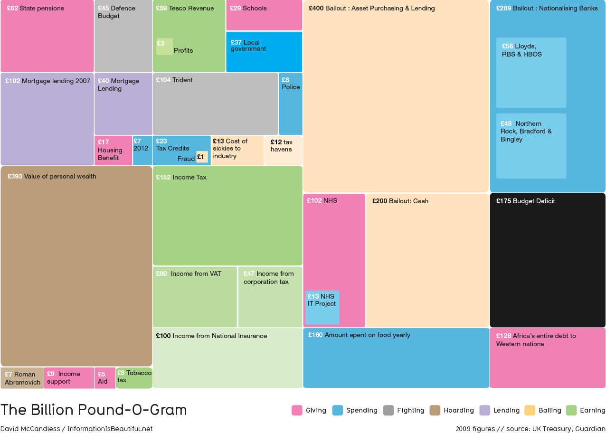

Treemap是一类可以同时显示宏观信息与细节信息以及层级的关系的数据呈现形式。
类似于 SmartMoney^[http://www.vizinsight.com/2010/12/%E6%B5%85%E8%B0%88%E5%B1%82%E6%AC%A1%E6%95%B0%E6%8D%AE%E7%9A%84%E5%8F%AF%E8%A7%86%E5%8C%96%E6%8A%80%E6%9C%AF%E4%B8%AD/] 的例子，我们可以将流量信息类比于股票。
先按照类别分组，然后用矩形的大小表示流量的大小，用颜色绿和红来表示流量的增幅（降幅）速度。
同时定期刷新该treemap。这样就能总体感知各个站点的整体流量情况了。

### FoamTree

Link: [http://get.carrotsearch.com/foamtree/demo/demos/large.html](http://get.carrotsearch.com/foamtree/demo/demos/large.html)

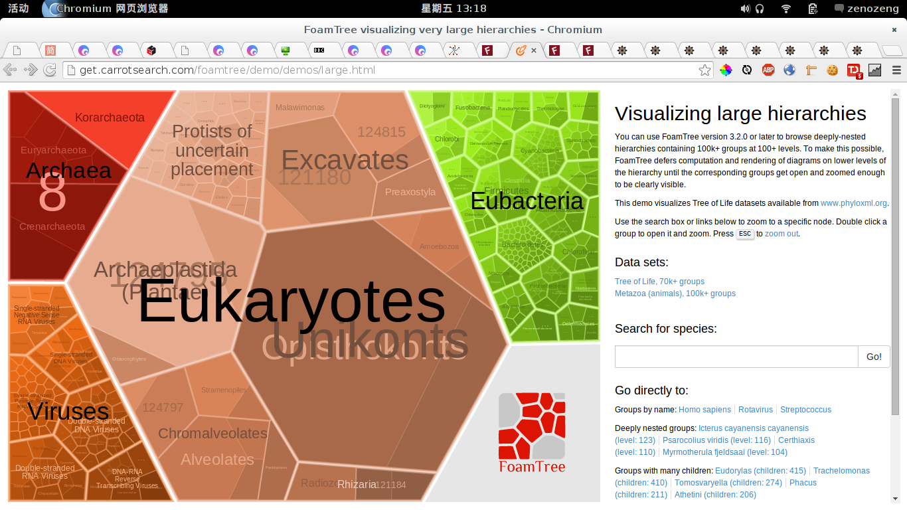

与前面的例子不同的是，这个适合于超大层级关系的树状关系。
可以很清晰地表达层间关系，位于父节点时，只会粗略显示子节点。
而使用双击缩放进入的方式来使得遍历节点，
而不让子孙节点干扰父节点的视觉展示。

## 气泡图

气泡图的一大特色是在二维图中反映出超过二维的信息。
通过气泡的大小、颜色等因素来展现额外的信息。

### The Antibiotic Abacus

Link: [http://www.informationisbeautiful.net/visualizations/antibiotic-resistance/](http://www.informationisbeautiful.net/visualizations/antibiotic-resistance/)

适用范围：多坐标维度交叉相关信息呈现。

### 20th Century Death (IO)

Link: [http://www.informationisbeautiful.net/visualizations/20th-century-death/](http://www.informationisbeautiful.net/visualizations/20th-century-death/)

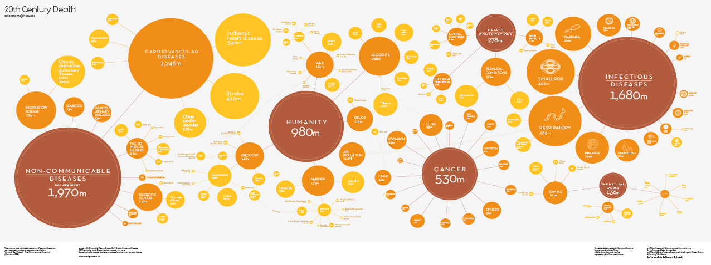

这个图其实非常适合关键词之类的分析。大小代表成交数据，颜色（色温）代表流量大小，
子层级是各个具体的关键词，而聚类后形成一个较大的分类。

### Snake Oil Supplements?

Link: [http://www.informationisbeautiful.net/play/snake-oil-supplements/](http://www.informationisbeautiful.net/play/snake-oil-supplements/)

### Better force layout node selection

Link: [http://bl.ocks.org/couchand/6420534](http://bl.ocks.org/couchand/6420534)

交互非常有趣，而且拉动对整个团的拖动效果可以直观地让人感受到数据的相关关系。
适合展现关联关系，比如多个关键词之间的相关关系。
但是有一点就是这个很难展示一个维度指标大小对其他维度的指标大小的影响。
嘛，还是适合简单的 text 类型的东西。
但是这种拖动拉力的感觉真的是很不错的。

## 平行坐标轴

### peoplemov.in (IO)

Link: [http://peoplemov.in/](http://peoplemov.in/)

以线直接相连，用渐变表示这是一根相连的线。
线的粗细表示流量的大小。
此展现方式亦非常适用于网站流量出入的展示。
一侧表现数据流量的流入方，另一侧则表示数据流量的流出方。

### worldshapin (IO)

Link: [http://www.worldshap.in/#/03/US/](http://www.worldshap.in/#/03/US/)

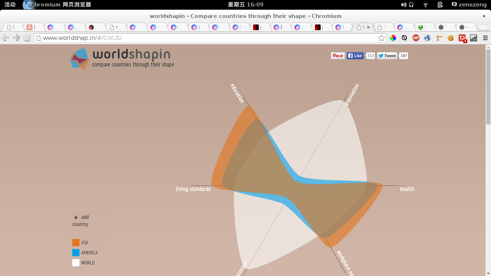

使用范围：多维度的数据对比

对于一个网站流量系统，可以将多个 site 的众多维度 访客量、驻留时间、跳出率 等因素叠在一起做一个类似的东西

### iris-parallel

Link: [http://mbostock.github.io/d3/talk/20111116/iris-parallel.html](http://mbostock.github.io/d3/talk/20111116/iris-parallel.html)

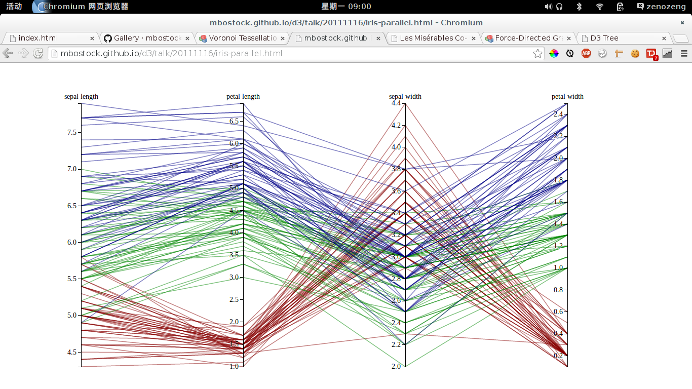

能够相对清晰地表明各个坐标的多个参数高低。
与上一个案例不同的是，此处展现的数据更多一些，以颜色来编组。
可以看出数据集中的总体趋势来。

## 可拖动轴

### Visualizing MBTA Data (IO)

An interactive exploration of Boston's subway system.

Link: [http://mbtaviz.github.io/](http://mbtaviz.github.io/)

这是一个交通流量的例子，但是鉴于交通流量与网络流量的相似性，这个例子还是非常有参考价值的。

这个图让人印象深刻，有非常强的数据交互联动，可以很直观的感受到数据随着时间的流动。
点是车所在的位置。各个端口是站点。

相应的，可以各个网站作为站点的替代，如果数据是跳出的则从相应站点出口离开，
否则则聚集到中心再到下一个节点。
每一个小点可以代表一个小波的流量。移动速度则按照用户的滞留时间进行计算。
右边时间轴的细线可用用户的seesion周期表示。
hover时间轴的时候就可以动态展现流量在各个节点之间的流动。
如果没有hover时间轴则可以自动滚动时间轴。

这张图则是代表每个站点的IO情况。
右边那个Avg情况分成两排上为 input，下为 output 。
然后以小的方格展示各个时段的情况，可以非常直观地展示一些细节情况。

### Jobs Charted by State and Salary

Link: [http://flowingdata.com/2014/07/02/jobs-charted-by-state-and-salary/](http://flowingdata.com/2014/07/02/jobs-charted-by-state-and-salary/)

一个数据与筛选条件轴联动的例子。

## 网络图

### Bible Cross-References

Link: [http://www.chrisharrison.net/index.php/Visualizations/BibleViz](http://www.chrisharrison.net/index.php/Visualizations/BibleViz)

注意颜色是与章节的远近相关的。底下的灰白分隔表示章节。每一个柱对应一句话。
但有一点就是，这个图中对原始信息的呈现觉得颇有些不够。

非常适合对大量有序列表进行相关性分析。

### DependencyWheel

Link: [http://redotheweb.com/DependencyWheel/](http://redotheweb.com/DependencyWheel/)

注意悬停一会可以显示其依赖关系。

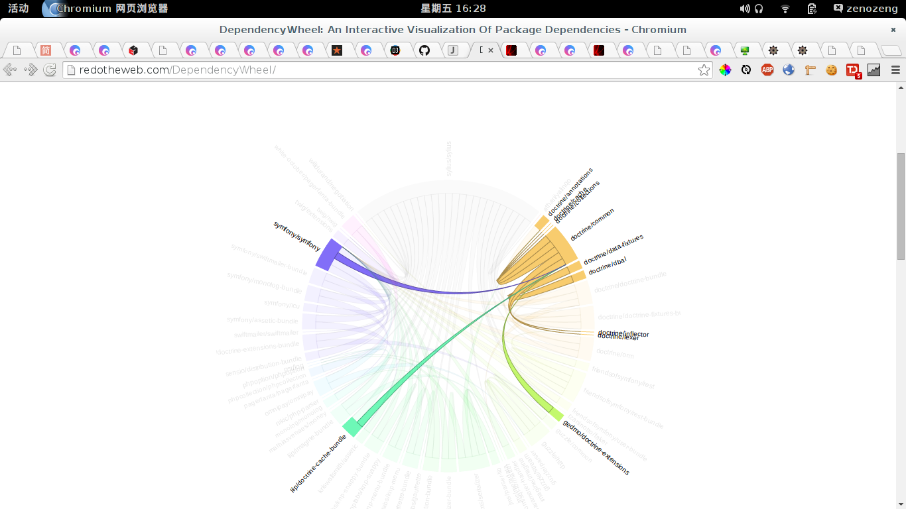

这个适合多对多的联系的显示。
适用于关键词、产品的关联显示。

## 地图

### Dencity

Link: [http://fathom.info/dencity/](http://fathom.info/dencity/)

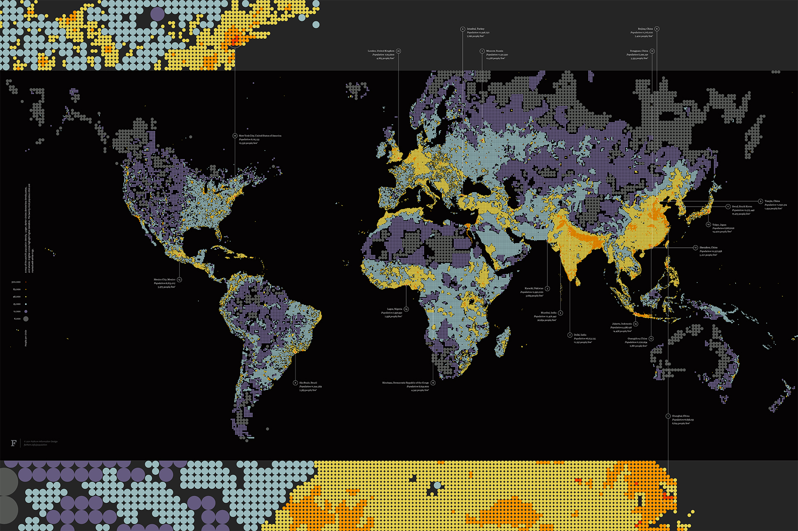

注意图中点的大小代表着个人的生存空间大小。
点越密，则个人的生存空间越小。

地图可表示目标指标与地域的联系。
比如流量与地域、成交额与地域、转化率与地域之类。
还有就是地域与某些特定商品的购物情况。
可以做定向的投放。

### World Bank Global Development Sprint

Link: [http://d3.artzub.com/wbca/](http://d3.artzub.com/wbca/)

另一个地图的例子。
但是增加了交互特性，动态显示各种流量的情况。
可以相对定性地去感知到各种流量的比例、在全球的流动情况。

## 热力图

~~关于热力图，有个想法。就是不仅仅只是跟踪鼠标的点击。而是同时监听hover事件。这样可以获得鼠标的轨迹。~~
似乎这个想法不大靠谱，劫持hover对性能的开销似乎不小而且意义并非那么大。

### webgl热力图-5个商圈的24小时

Link: [webgl热力图-5个商圈的24小时](http://datavlab.org/cat/%E5%8F%AF%E8%A7%86%E5%8C%96%E6%A1%88%E4%BE%8B/%E5%8F%AF%E8%A7%86%E5%8C%96%E5%B1%95%E7%8E%B0%E7%B1%BB%E5%9E%8B/%E7%83%AD%E5%8A%9B%E5%9B%BE)

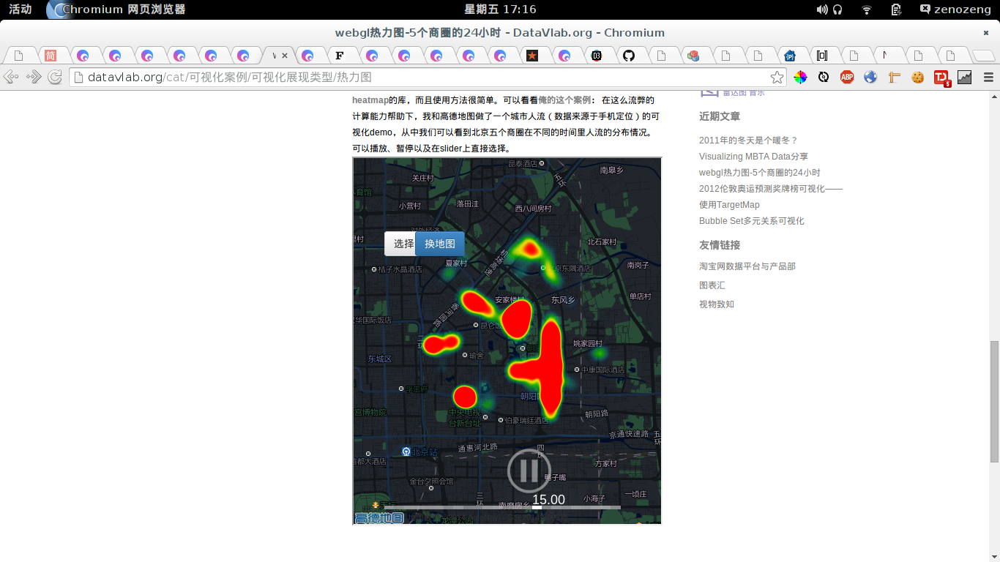

一个实时活动的例子。

## Matrix

### Les Misérables Co-occurrence (IO)

Link: [http://bost.ocks.org/mike/miserables/](http://bost.ocks.org/mike/miserables/)

一个有趣的矩阵。
嘛，切换右上角的 order 会有 transition 动画可以看。
觉得对流量分析也是挺有价值的。
有两个维度，一个可为 input，二另一个可为 output，
则相交的高亮色块可表示该条流量路径的相对流量大小。
以其流量与热力学温度正相关，然后转化为色温，
就能非常直观地感受整个的流量情况。

如果要是和时间轴（或其他某个参数轴）相结合的话，就能感受到，
各个路径流量色块随着该参数而变化的样子。
嘛，应该还是挺有趣的。

相比典型的气泡图，小方块的呈现虽然丢失大小这个维度，
但是感觉整齐的方块也使得整个数据呈现非常紧凑，
数据的呈现密度较大，能呈现更大的数据集。

### iris-splom (IO)

Link: [http://mbostock.github.io/d3/talk/20111116/iris-splom.html](http://mbostock.github.io/d3/talk/20111116/iris-splom.html)

四个参数，每张图（除开对角线）表示其中两个参数的相关关系。
非常值得注意的是，每个图是可以用矩形选择（见下图）区域的，
选择发生后，在矩形区域的点集会在16图上被高亮，
而其他的点则是被灰化显示。
可以非常直观地感受一部分点的各个参数相关情况。

则对于流量分析，可以得知一部分目标用户集（比如A参数和B参数都位于右上角的用户）
各个参数相关情况的情况。对于快速分析目标用户的情况还是非常有帮助的。

## Etc

### Analyzing Presidential Candidate’s Body Language

Link: [http://www.nytimes.com/interactive/2012/10/02/us/politics/what-romney-and-obamas-body-language-says-to-voters.html?hp&_r=0](http://www.nytimes.com/interactive/2012/10/02/us/politics/what-romney-and-obamas-body-language-says-to-voters.html?hp&_r=0)

手势的一个分析。

### Calendar View

Link: [http://bl.ocks.org/mbostock/4063318](http://bl.ocks.org/mbostock/4063318)

类似于 Github 的 Commit 那个记录。
可以相对直观地反应较长期中各天的情况。

### Stacked-to-Grouped Bars

Link: [http://bl.ocks.org/mbostock/3943967](http://bl.ocks.org/mbostock/3943967)

这个例子有上有 Stacked 和 Grouped 的一键切换，非常直观的。

关于两种图的选择：
If there is no part to whole relationship (maybe there is overlap in the categories), then grouped is definitely the option you want to use. If there is a part to whole relationship, then the next question to ask is what relationship is the most important to show. If the goal is to show sizes between individual categories, use a grouped column or bar chart. If the goal is to show the total sizes of groups, use a regular stacked bar chart. If the goal is to show relative differences within each group, use a stacked percentage column chart.
^[http://blog.visual.ly/how-groups-stack-up-when-to-use-grouped-vs-stacked-column-charts/]

### Streamgraph

Link: [http://bl.ocks.org/mbostock/4060954](http://bl.ocks.org/mbostock/4060954)

For continuous data such as time series, a streamgraph can be used in place of stacked bars. 
